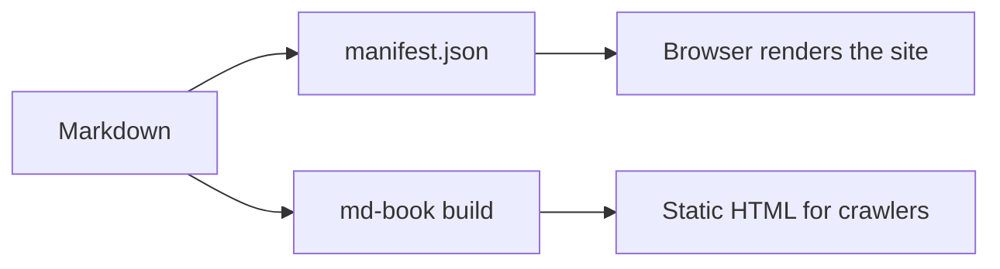

# Search, math & diagrams

## Search

Press `/` (or `Ctrl`/`⌘` + `K`) to search every page. The index is a plain
`search-index.json` built by `md-book search-index`; it is fetched the first time you type.
Japanese works too — try 縦書き.

## Math

Add `math` to `<md-book>` and write TeX between dollar signs. Inline: $e^{i\pi} + 1 = 0$. Display:

$$
\int_{-\infty}^{\infty} e^{-x^2}\,dx = \sqrt{\pi}
$$

Prices such as $5 and $10 stay plain text.

## Diagrams

Add `mermaid` and fence a diagram with ` ```mermaid `. It follows the light / dark theme.



## Languages

This site has an English and a Japanese edition: the default language lives at the content root and
`ja/` holds the translation. Use the language switcher in the header — it jumps to the same page in the
other language when there is one.
