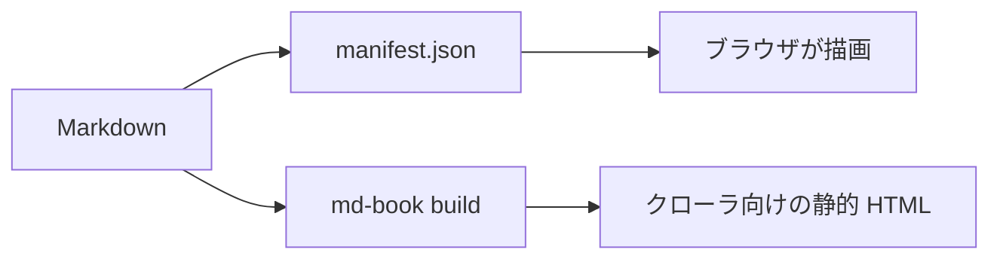

# 検索・数式・図

## 検索

`/`（または `Ctrl`/`⌘` + `K`）で全ページを検索できます。索引は `md-book search-index` が作る
`search-index.json` で、最初に入力したときに読み込まれます。日本語の全文検索にも対応しています。

## 数式

`<md-book>` に `math` を付け、ドル記号で TeX を囲みます。インライン: $e^{i\pi} + 1 = 0$。ブロック:

$$
\int_{-\infty}^{\infty} e^{-x^2}\,dx = \sqrt{\pi}
$$

## 図

`mermaid` を付けて ` ```mermaid ` のコードブロックを書きます。ライト／ダークのテーマに追従します。



## 言語

このサイトには英語版と日本語版があります。ヘッダーの言語切り替えで、同じページの別言語版に移動できます。
